# CartPoleControl

### LQR and Model Predictive Control of an Underactuated Cart-Pole System (C++ / Eigen)

This repository implements stabilization of a nonlinear cart-pole system using two optimal control approaches:

* **Discrete-Time Linear Quadratic Regulator (LQR)**
* **Model Predictive Control (MPC)**

The cart-pole is a classical underactuated control problem in which a horizontal force applied to the cart must simultaneously regulate cart motion and stabilize an unstable inverted pendulum.

The implementation is written in modern **C++17** using **Eigen** and includes Python tools for visualization, animation, and controller comparison.

---

## Features

* Nonlinear cart-pole dynamics
* State-space system formulation
* Linearization around upright equilibrium
* Discrete-time LQR controller
* Finite-horizon MPC controller
* Input force constraints
* Discrete Riccati equation solver
* RK4 numerical integration
* Closed-loop stabilization
* CSV logging
* Python visualization tools
* Cart-pole animation
* LQR vs MPC comparison

---

## Mathematical Formulation

State vector:

```text
x = [ x
      x_dot
      theta
      theta_dot ]
```

where:

* `x` = cart position [m]
* `x_dot` = cart velocity [m/s]
* `theta` = pole angle [rad]
* `theta_dot` = pole angular velocity [rad/s]

Control input:

```text
u = horizontal force applied to the cart
```

The nonlinear system is linearized around the upright equilibrium:

```text
x = 0
x_dot = 0
theta = 0
theta_dot = 0
```

resulting in the state-space model:

```text
x_dot = A x + B u
```

---

## Linear Quadratic Regulator (LQR)

The LQR controller computes a fixed feedback gain:

```text
u = -Kx
```

where the gain matrix `K` is obtained by solving the Discrete Algebraic Riccati Equation (DARE).

The controller minimizes:

```text
J = Σ (xᵀQx + uᵀRu)
```

where:

* `Q` penalizes state error
* `R` penalizes control effort

---

## Model Predictive Control (MPC)

The MPC controller predicts future system behavior over a finite horizon and computes an optimal control sequence online.

At each control update, MPC minimizes:

```text
J = Σ (xᵀQx + uᵀRu)
```

subject to:

```text
u_min ≤ u ≤ u_max
```

Only the first control action is applied before the optimization is repeated at the next update step (receding horizon control).

### MPC Parameters

```text
Prediction horizon : 50 steps
Control update     : 20 ms
Force limits       : ±10 N
```

The implementation includes:

* warm-started control sequence
* constrained inputs
* finite-horizon optimization
* receding-horizon control

---

## Project Structure

```text
CartPoleControl/
│
├── include/
│   ├── CartPole.hpp
│   ├── LQR.hpp
│   └── MPC.hpp
│
├── src/
│   ├── CartPole.cpp
│   ├── LQR.cpp
│   ├── MPC.cpp
│   └── main.cpp
│
├── scripts/
│   ├── plot_results.py
│   ├── animate_cartpole.py
│   ├── compare_controllers.py
│   └── requirements.txt
│
├── data/
│
├── CMakeLists.txt
├── README.md
└── LICENSE
```

---

## Build

```bash
mkdir build
cd build

cmake ..
make -j$(nproc)
```

---

## Run

Run the LQR controller:

```bash
./cartpole_control lqr
```

Run the MPC controller:

```bash
./cartpole_control mpc
```

Simulation logs are written to:

```text
data/lqr.csv
data/mpc.csv
```

---

## Visualization

Install dependencies:

```bash
cd scripts
pip install -r requirements.txt
```

Generate plots:

```bash
python plot_results.py lqr
python plot_results.py mpc
```

Generate animations:

```bash
python animate_cartpole.py lqr
python animate_cartpole.py mpc
```

Generate controller comparison figures:

```bash
python compare_controllers.py
```

---

## Results

### LQR Results

#### Cart State Response

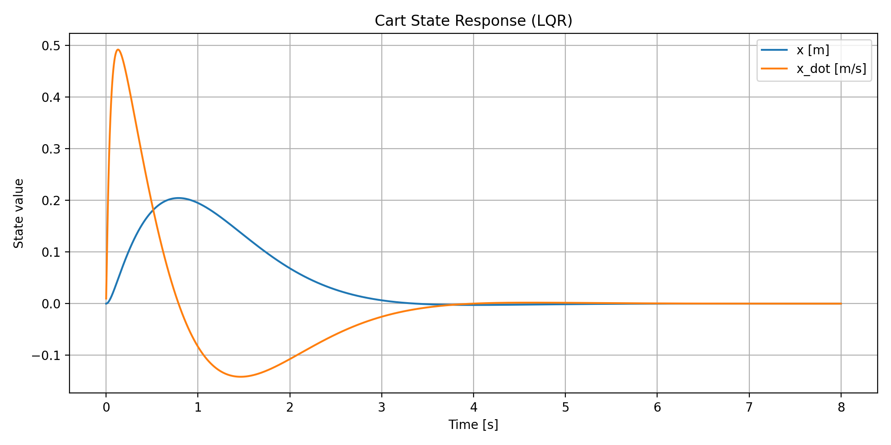

#### Pole State Response

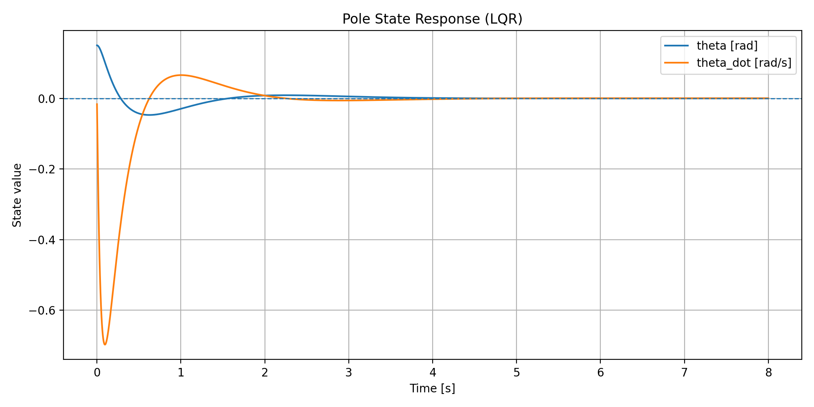

#### Control Force

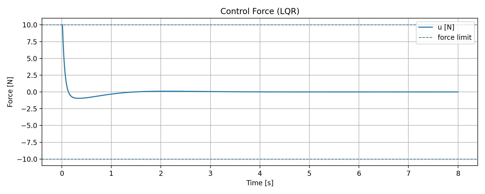

#### Pole Phase Portrait

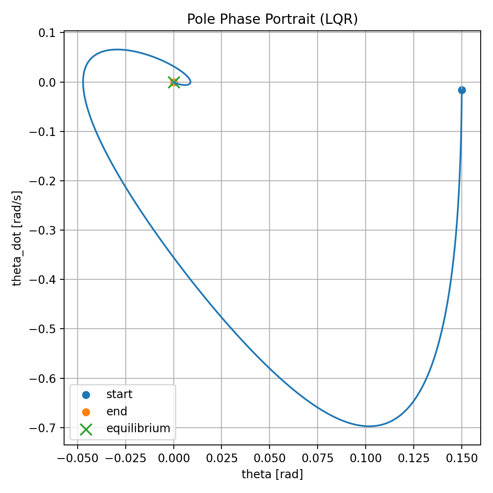

#### Animation

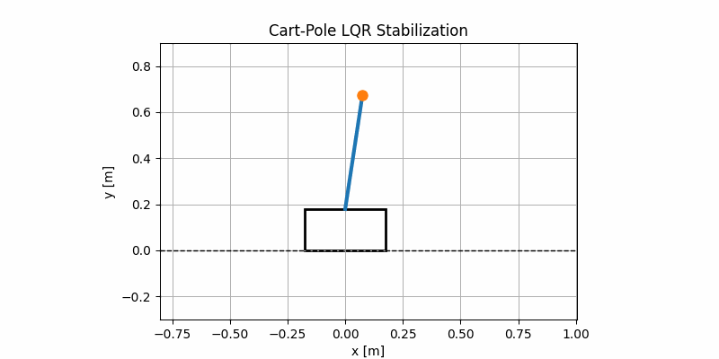

---

### MPC Results

#### Cart State Response

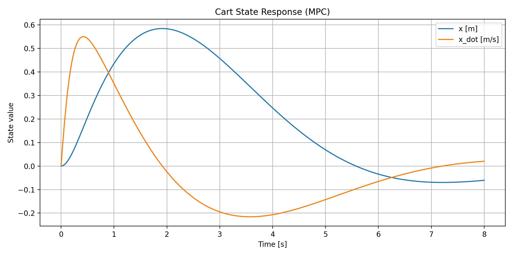

#### Pole State Response

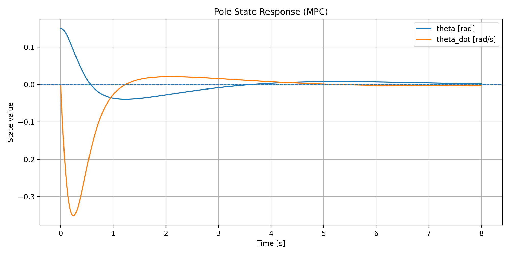

#### Control Force

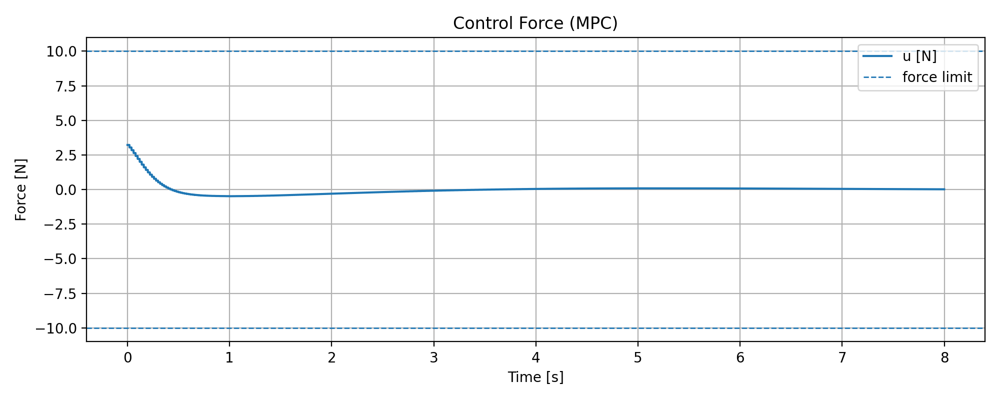

#### Pole Phase Portrait

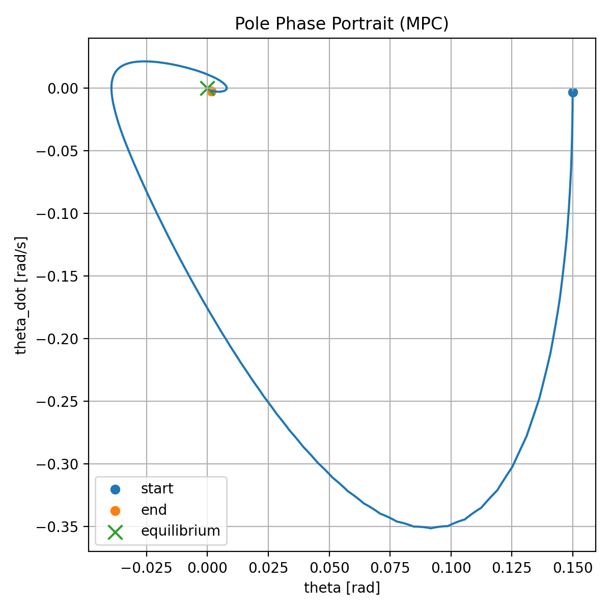

#### Animation

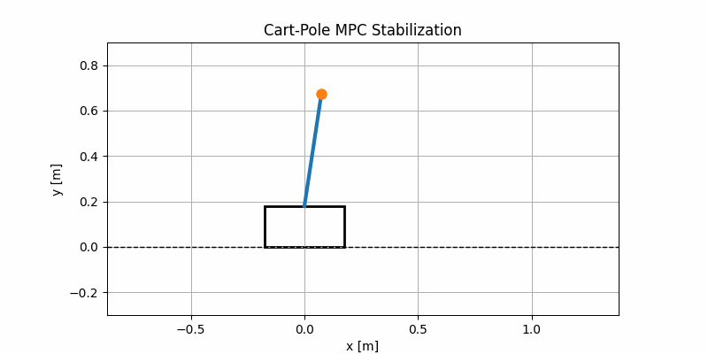

---

### Controller Comparison

#### Pole Angle Comparison

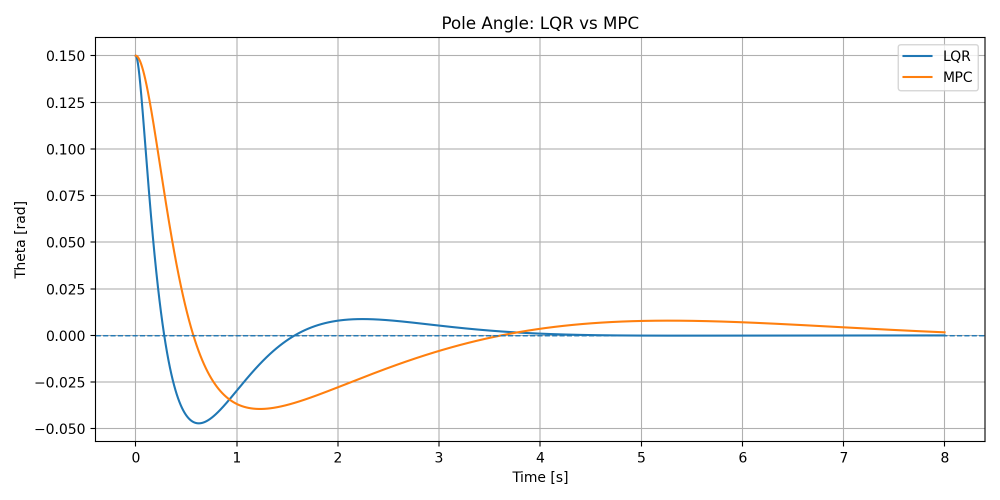

#### Cart Position Comparison

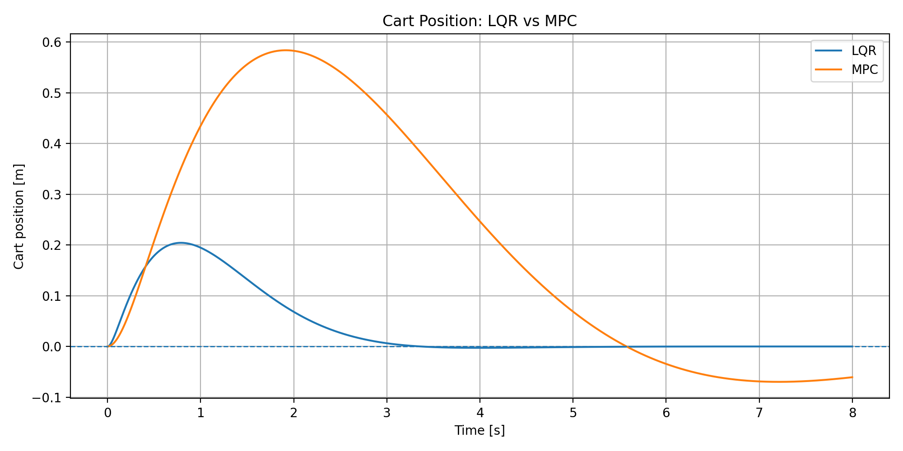

#### Control Force Comparison

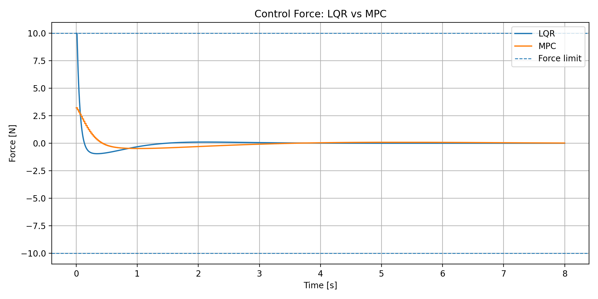

#### Pole Phase Portrait Comparison

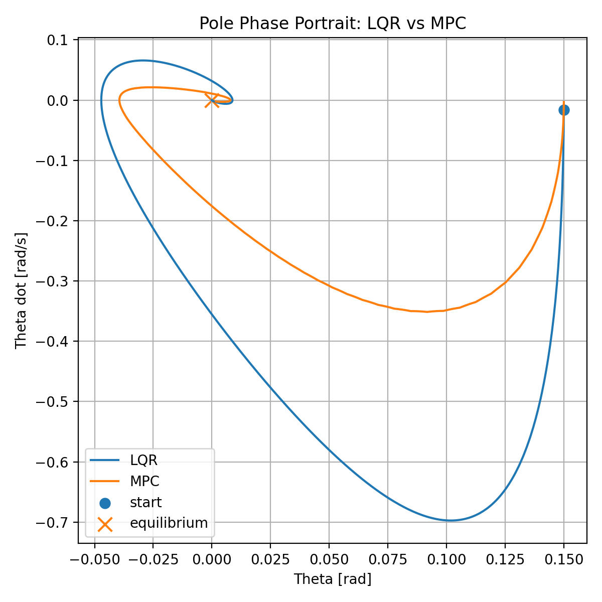

---

## Controller Comparison Summary

| Feature                   | LQR     | MPC     |
| ------------------------- | ------- | ------- |
| Computational Cost        | Low     | Higher  |
| Online Optimization       | No      | Yes     |
| Explicit Constraints      | No      | Yes     |
| Fixed Gain                | Yes     | No      |
| Input Saturation Handling | Limited | Natural |
| Stabilization             | Yes     | Yes     |

LQR provides a computationally efficient optimal controller based on a fixed feedback gain.

MPC repeatedly solves a finite-horizon optimization problem, allowing explicit handling of actuator constraints and future extensions to state constraints.

---

## Numerical Integration

The nonlinear cart-pole dynamics are integrated using a fourth-order Runge–Kutta (RK4) method.

Compared with Euler integration, RK4 provides improved numerical accuracy and stability for closed-loop simulations.

---

## Dependencies

### C++

* C++17
* Eigen3
* CMake ≥ 3.10

### Python

```text
numpy
pandas
matplotlib
pillow
```

---

## License

MIT License

