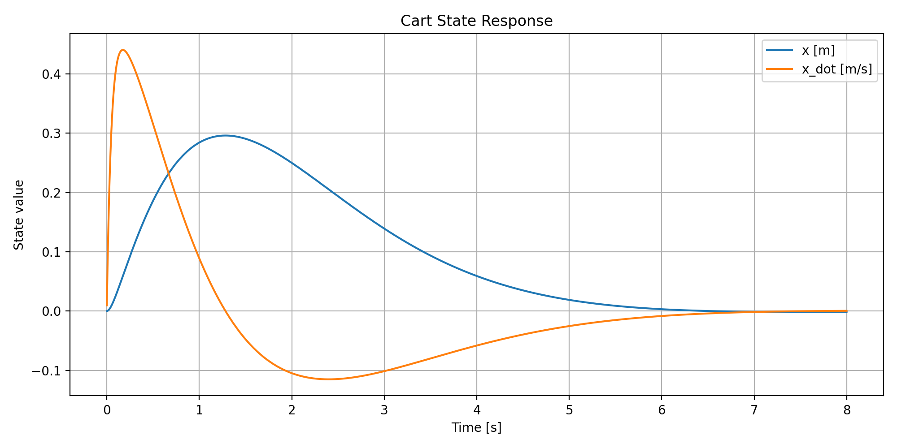
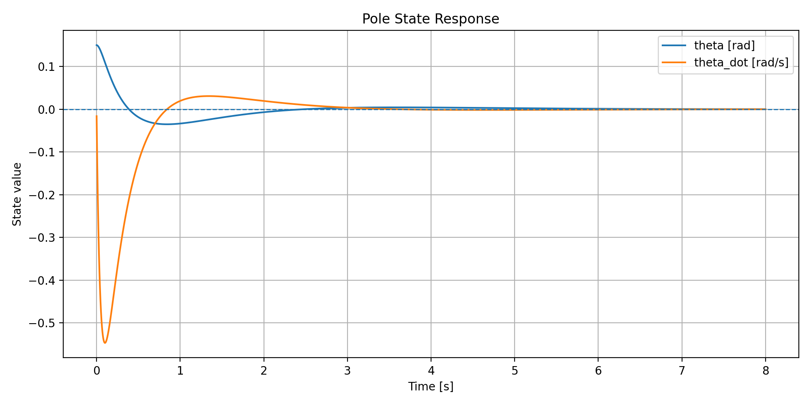
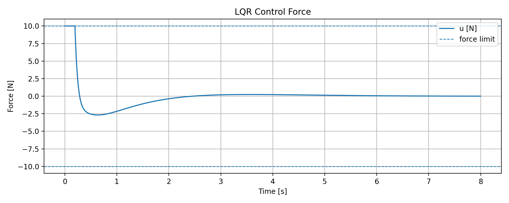
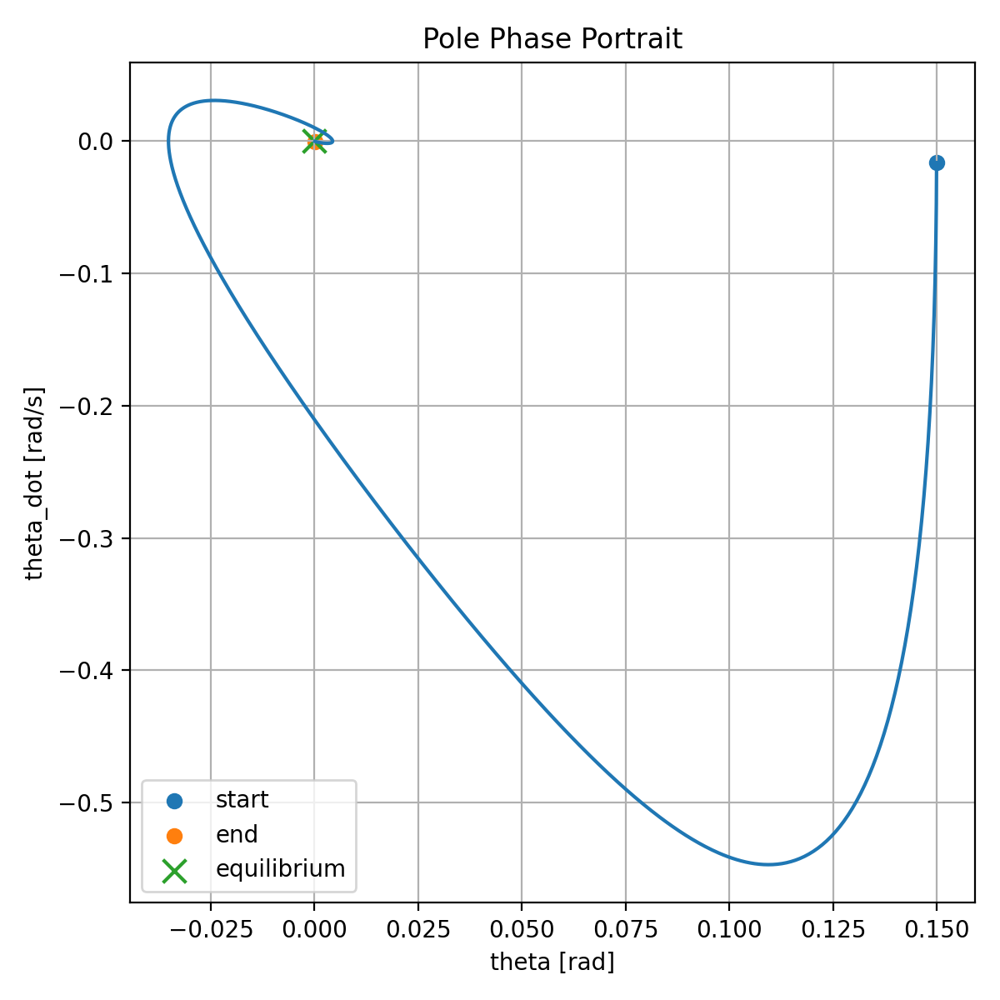
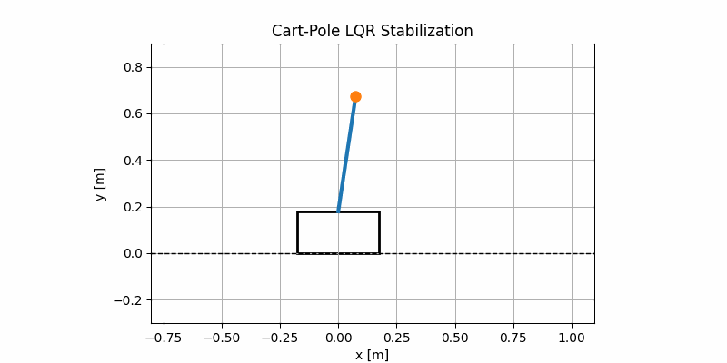

# CartPoleControl

### Discrete-Time LQR Control of an Underactuated Cart-Pole System (C++ / Eigen)

This repository implements stabilization of a nonlinear cart-pole system using a discrete-time Linear Quadratic Regulator (LQR).

The cart-pole is a classical underactuated control problem in which a horizontal force applied to the cart must simultaneously regulate cart motion and stabilize an unstable inverted pendulum.

The implementation is written in modern C++ (C++17) using Eigen and includes Python tools for visualization and animation.

---

## Features

- Nonlinear cart-pole dynamics
- State-space system formulation
- Linearization around upright equilibrium
- Discrete-time LQR controller
- Discrete Riccati equation solver
- RK4 integration
- Closed-loop stabilization
- CSV logging
- Python visualization tools
- Cart-pole animation

---

## Mathematical Formulation

State vector:

```text
x = [ x
      x_dot
      theta
      theta_dot ]
```

where:

- x = cart position
- x_dot = cart velocity
- theta = pole angle
- theta_dot = pole angular velocity

Control input:

```text
u = horizontal force applied to the cart
```

The linearized system is:

```text
x_dot = A x + B u
```

and the discrete-time LQR controller computes:

```text
u = -K x
```

by minimizing:

```text
J = Σ (xᵀQx + uᵀRu)
```

where:

- Q penalizes state error
- R penalizes control effort

---

## Project Structure

```text
CartPoleControl/
│
├── include/
│   ├── CartPole.hpp
│   └── LQR.hpp
│
├── src/
│   ├── CartPole.cpp
│   ├── LQR.cpp
│   └── main.cpp
│
├── scripts/
│   ├── plot_results.py
│   ├── animate_cartpole.py
│   └── requirements.txt
│
├── data/
│
├── CMakeLists.txt
├── README.md
└── LICENSE
```

---

## Build

```bash
mkdir build
cd build

cmake ..
make -j4
```

---

## Run

```bash
./cartpole_lqr
```

This generates:

```text
data/simulation.csv
```

containing:

- cart position
- cart velocity
- pole angle
- pole angular velocity
- control force

---

## Visualization

Install dependencies:

```bash
cd scripts
pip install -r requirements.txt
```

Generate plots:

```bash
python plot_results.py
```

Generate animation:

```bash
python animate_cartpole.py
```

---

## Results

### 🔹 Cart State Response (`data/cart_state_response.png`)

This figure shows the cart position and velocity over time as the controller regulates the cart while stabilizing the pole.

<p align="center">
  
</p>

---

### 🔹 Pole State Response (`data/pole_state_response.png`)

This figure shows the pole angle and angular velocity converging toward the upright equilibrium.

<p align="center">
  
</p>

---

### 🔹 Control Force (`data/control_force.png`)

This figure shows the force generated by the LQR controller to stabilize the cart-pole system.

<p align="center">
  
</p>

---

### 🔹 Pole Phase Portrait (`data/pole_phase_portrait.png`)

This phase portrait visualizes the pole state in angle–angular velocity space. The trajectory converges toward the origin, indicating successful stabilization of the upright equilibrium.

<p align="center">
  
</p>

---

### 🔹 Cart-Pole Animation (`data/cartpole_lqr.gif`)

Animated visualization of the closed-loop cart-pole motion under LQR control.

<p align="center">
  
</p>

---

## Numerical Integration

The simulation uses RK4 (Runge–Kutta 4th Order) integration for improved numerical accuracy and stability compared to simple Euler integration.

---

## Dependencies

### C++

- C++17
- Eigen3
- CMake ≥ 3.10

### Python

```text
numpy
pandas
matplotlib
pillow
```

---

## License

MIT License
